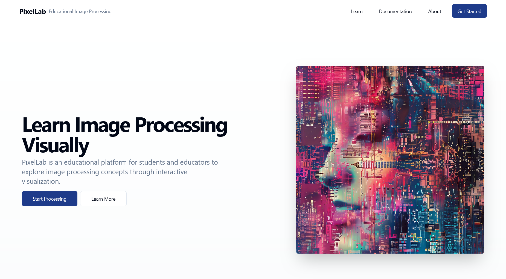
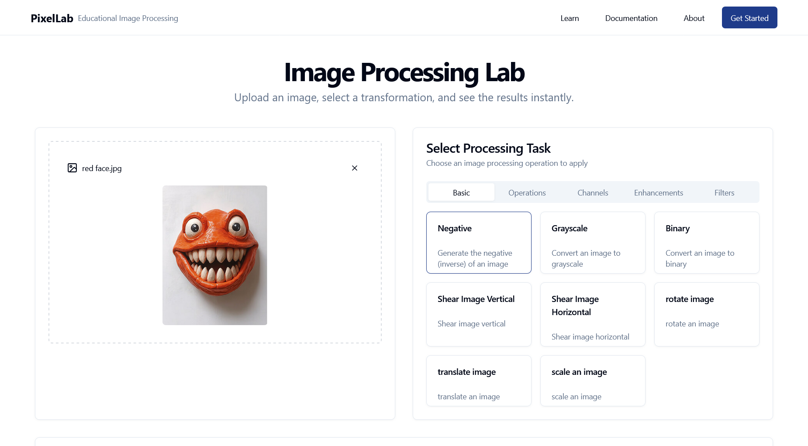
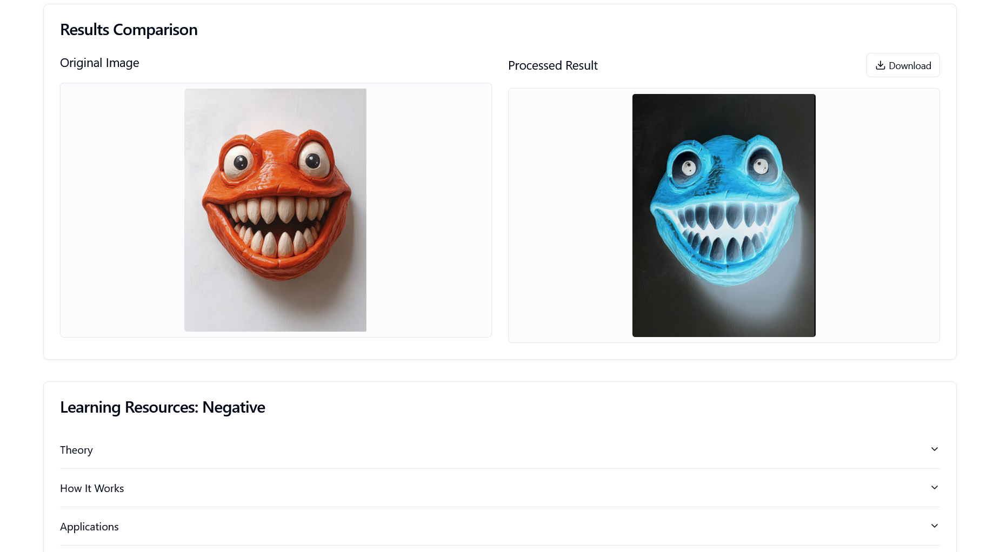

# Pixels - Interactive Image Processing Platform

Pixels is a minimal, modern web application designed to help learners and educators visualize and understand core concepts of image and video processing using OpenCV. The platform allows users to apply a range of transformations to images in real time, making it a valuable educational tool for courses in computer vision and related fields.



 

## Features

- Upload images from your device
- Apply common image processing operations:
  - Negative filter
  - RGB channel separation
  - Prewitt, Sobel, and other convolution filters
  - Denoising
  - Logical operations (e.g., XOR)
- Backend responses may include:
  - Single processed image
  - ZIP file containing multiple images (e.g., separated RGB channels)
- Side-by-side display of original and processed images
- Clean, responsive user interface with smooth interactions

## Target Audience

Pixels is designed for:

- University students studying image and video processing
- Educators building teaching aids
- Beginners exploring OpenCV and computer vision
- Developers prototyping visual image transformations

## Tech Stack

- Frontend: React.js, Tailwind CSS
- Backend: FastAPI, OpenCV
- File Handling: StreamingResponse and zipfile (Python), JSZip (Frontend)

## Project Structure

```
pixels/
├── backend/              # FastAPI server and image processing logic
│   ├── main.py
│   ├── tasks.py
│   └── utils/
├── frontend/             # React app with UI for uploading, previewing, and viewing results
│   ├── src/
│   └── components/
├── README.md
```

## Getting Started

### Backend Setup (FastAPI + OpenCV)

#### Prerequisites

- Python 3.8+
- uv (modern Python package/dependency manager)
- OpenCV

Install uv:

```bash
pip install uv
# or
pip3 install uv
```

Refer to the official uv installation guide for details.

#### Install dependencies

Navigate to the backend directory:

```bash
cd backend
uv sync
```

This will install all dependencies listed in `pyproject.toml`.

#### Start the development server

```bash
uv run uvicorn main:app --reload
```

The FastAPI server will be available at: http://localhost:8000

### Frontend Setup (React + Tailwind CSS)

#### Prerequisites

- Node.js 16+
- npm or yarn

#### Setup and Run

```bash
cd frontend
npm install
npm run dev
```

The React frontend will be available at: http://localhost:8080

## Example API Endpoints

All POST requests expect `multipart/form-data` with either:

- `file=`
- or `files=`

| Endpoint                | Description                                                       |
|-------------------------|-------------------------------------------------------------------|
| /api/task/negative      | Returns the negative version of an image                          |
| /api/task/rgb-channels  | Returns a ZIP file with R, G, B isolated images                  |
| /api/task/xor           | Accepts a ZIP of two images and returns an image with XOR applied |
| /api/task/prewitt       | Applies Prewitt filter for edge detection                        |
| /api/task/sobel         | Applies Sobel filter                                              |
| /api/task/denoise       | Performs noise removal using Gaussian or median blur              |

## Sample CURL Usage

```bash
curl -X POST http://localhost:8000/api/task/negative \
     -F "file=@path/to/image.png" \
     --output result.png
```

## User Interface Features

- Upload area (drag and drop or file picker)
- Dropdown to select transformation
- Process button to send request to backend
- Side-by-side view of original and output images
- Handles both single image responses and ZIP files

## Educational Value

- Real-time visual understanding of OpenCV operations
- Demonstrates frontend-backend integration using HTTP and media formats
- Facilitates understanding of filters, color channels, and noise reduction
- Suitable for labs, assignments, or interactive demonstrations

## Possible Enhancements

- Additional filters (Gaussian, Laplacian, Canny)
- Image histogram and equalization tools
- Video support (upload and process frames)
- Save/export results and download ZIP files directly
- User authentication for session-based storage

## License

MIT License © 2025 Your Name

## Contributing

Contributions are welcome. Please create an issue for discussion before submitting pull requests. Ensure clear commit messages and proper documentation of code.

## Acknowledgments

- OpenCV for image processing libraries
- FastAPI for the backend framework
- React and Tailwind CSS for the frontend

---

For any questions or suggestions, please open an issue in the repository.

---